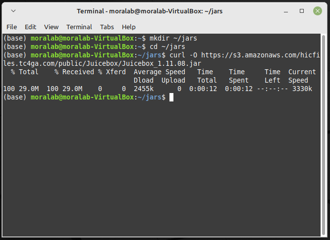
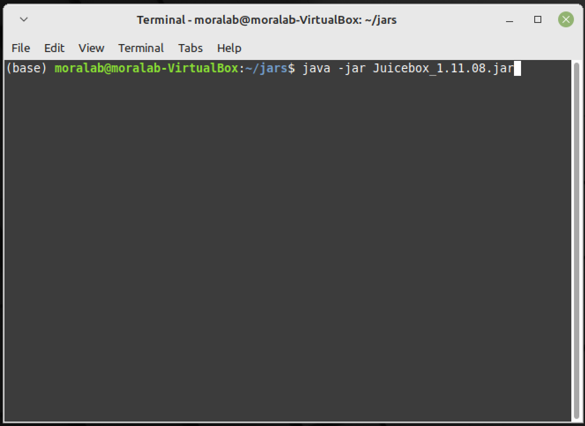

# Installing Juicebox in Linux
<br>

> The following are the instructions to install **Juicebox** (version 1.11.08) on Linux. The tutorial uses a **Linux Mint 21** installed in a **VirtualBox 7.0.2** virtual machine, as described here: [Creating a Linux Mint-21 VM](../../../../../virtualbox/blob/main/virtualbox/tutorial_2022/). Also, **Anaconda3**, as described here: [Installing Anaconda3](../../../../../anaconda/blob/main/tutorial_2022/).

## - First steps

> 1. Go to your Linux machine. In our case, open the **VirtualBox** and start the VM.
<br>

<br><br>

<br>

> 2. Open a new terminal and activate the `base` conda environment.
```
cd ~/anaconda3/bin
. ./activate
```

<br>

<br>

> 3. Verify that **java** is present in the `base` environment. In this example, you will find **java 11.0.17**.
```
java –version
```

<br>

<br>

## - Downloads

> 4. Create a folder to store the *.jar* file. Download it from the addresses below.
```
mkdir ~/jar
cd ~/jar
curl -O https://s3.amazonaws.com/hicfiles.tc4ga.com/public/Juicebox/Juicebox_1.11.08.jar
```

> In order to find the latest version, go [here](https://github.com/aidenlab/Juicebox/wiki/Download).

<br>

<br><br>

<br>

## - Running Juicebox

> 5. You can directly run `Juicebox`.
```
java -jar Juicebox_1.11.08.jar
```

<br>

<br><br>

<br>

<br>

*Last updated: Antonio Mora, November 23rd, 2022*
