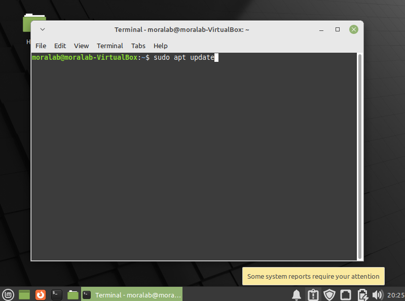
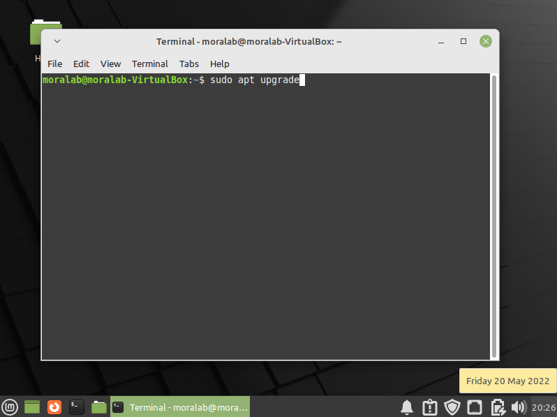
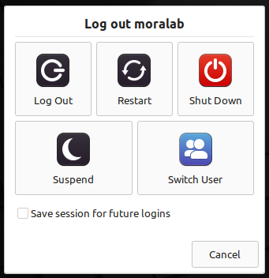
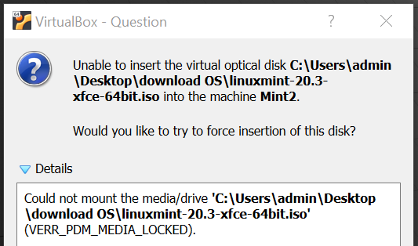
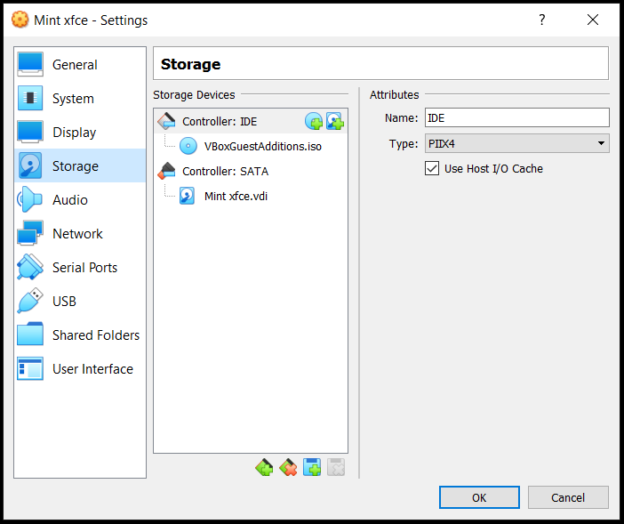
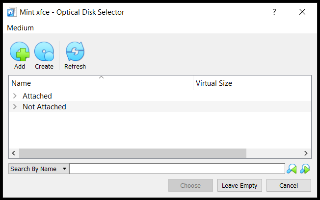
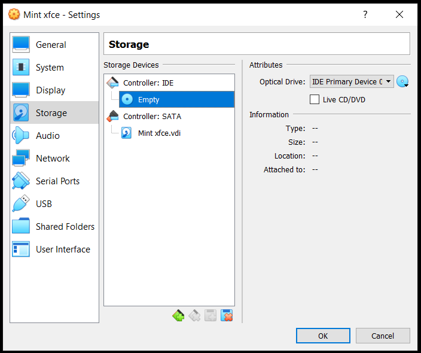

# Creating a new Virtual Machine using VirtualBox
<br>

> The following are the instructions to create a virtual machine (VM) in **VirtualBox 7.0.2** for **Windows 11** (now referred as the "host" operative system) and install the **Mint-21-xfce** Linux system (now referred as the "guest" operative system). A similar process can be followed for other host and guest OS.

## - Downloads
<br>

> 1. Download the ISO file with our guest OS (Mint-21-xfce) [here](https://linuxmint.com/edition.php?id=301). For this tutorial, we have downloaded our OS from here: [Download](https://mirrors.layeronline.com/linuxmint/stable/21/linuxmint-21-xfce-64bit.iso).

## - Installing VirtualBox
<br>

> 2. If you haven't installed **VirtualBox**, first go to our tutorial to install it:

> [How to install VirtualBox](../../../../../virtualbox/blob/main/virtualbox/tutorial_2022/)

## - Creating a new Virtual Machine
<br>

> 3. Open **VirtualBox**. To create a new VM, click on **"New"** and the "Create Virtual Machine" window will be opened. There are two modes to do this: The "Guided Mode" and the "Expert Mode". We will start with the guided mode, which is the default.

> Choose a name, a folder, the location of the ISO file you just downloaded, and the type of operative system to be installed (Linux Mint 21 is derived from Ubuntu jammy). Also, select **Skip Unattended Installation**, as we would like to install it manually.

<br>

<br>

<br>

<br>

> 4. Define your desired memory and hard-disk specifications. Here we have chosen the maximum recommended memory and 300 GB hard disk.

<br>

<br>

<br>

> 5. After this, your first Virtual Machine will be created.

<br>

<br>

<br>

> 6. Optional/Alternative to previous steps: Choose the "Expert mode" (second button) and follow the instructions in a single screen:

> First, add the information related to "name and operating system", that is, (i) The name you will give to your VM, (ii), the folder in which the VM will be created, (iii) the ISO image with the OS that we downloaded in a previous step, (iv) if the system does not recognize the OS, then you should manually add that information (Mint-21 is a Linux, Ubuntu 64-bit), (v) if you check the box, you will skip unattended installation.

<br>

<br>

> Second, if you didn't check the box in the previous step, now you must add the information related to "unattended installation", that is, basically, username and password.

<br>

<br>

> Third, you add the "hardware" information, that is the size of the RAM and number of CPUs your VM will use. You must leave some RAM and CPU for your host OS too, so only values inside the green range are recommended. Here we chose 8 GB RAM and 1 CPU.

<br>

<br>

> Fourth, you either create a virtual hard disk or use an existing virtual hard disk. Here we will create one with a size of 200 GB.

<br>

<br>

> 6. Optional/Recommended: To improve the video memory, go to **Settings**, **Display**, and **Screen**. Here we raised the video memory from the specified value to 128 MB.

<br>

<br>

<br>

<br>

> 7. Optional/Recommended: Go to *Settings - USB*, press the right side icon, and find the device you want to mount.

<br>

<br>

<br>

## - Installing the OS in our VM (Linux-Mint-21-xfce)
<br>

> 8. Now we can proceed to install the OS for our new VM: 

> Press **Start** and the installation process will begin.

<br>

<br>

> 9. Click on "Install Linux Mint".

<br>

<br>

> 10. Select installation language and keyboard layout.

<br>

<br>

<br>

> 11. Select installation type options, including multimedia codecs and erase disk options.

<br>

<br>

<br>

<br>

> 12. Choose location, username, and password.

<br>

<br>

<br>

> 13. Linux Mint will then be installed. After installation is finished, you will be prompted to press **Restart Now** and **Enter**.

<br>

<br>

<br>

<br>

> 14. Type your password and you should gain access to Linux Mint.

<br>

<br>

<br>

> 15. If needed, increase the size of the screen.

<br>

<br>

## - Updates

> 16. If the **Update Manager** icon displays a red spot, you may need to click to update some of the software and then reboot.

<br>

<br>

<br>

<br>

> 17. Optional: As an alternative, we can use **apt update** and **apt upgrade**.

<br>

<br>

<br>

## - Installing VirtualBox Guest Additions

> 18. Installing guest additions is important to gain multiple functionality (especially normalizing the size of the screen). Open a terminal and follow the procedure:
```
sudo apt install build-essential module-assistant
sudo m-a prepare
```

<br>

<br>

<br>

> 19. In the VM menu, go to **Devices** and click on **Insert Guest Additions CD image**.

<br>

<br>

<br>

> 20. If the CD image runs automatically, simply follow the steps. If not, go to your terminal and run it as in the following example:
```cd ../../media/moralab/VBox_GAs_7.0.2/
sudo ./VBoxLinuxAdditions.run
```

<br>

<br>

<br>

> 21. Restart the VM.

<br>

<br>

> 22. After restarting, you can immediately observe the changes in the screen.

<br>

<br>

## - Using the USB drive

> 23. To mount the USB drive, go to the menu and click on **Devices** -> **USB** -> and then the name of your USB device.

<br>

<br>

> 24. You can now open the file manager and see the USB (in our case, appears as a "32 GB volume").

<br>

<br>

> 25. To unmount the USB drive (and leave it under the Windows host OS), go again to **Devices** -> **USB** -> and uncheck the name of your USB device.

<br>

<br>

<br>

## - Final result

> 26. That's it. Now you have a fully functional **Mint-21-xfce** VM in a **Windows 11** computer.

<br>

<br>

## - Troubleshooting

> Problem1. When you maximize your VM, only the VM menu maximizes while the Linux Mint windows stays small.
Solution1. You just need to minimize and maximize again and the changes will be evident.

> Problem2. When installing the Guest Additions, you get the error message "VERR_PDM_MEDIA_LOCKED".
Solution2. You might need to close the VM, go to **Settings**/**Storage**, click on the CD icon, and click on **Leave empty**. Then return to the VM and try to install again.

<br>

<br>

<br>

<br>

<br>

*Last updated: Antonio Mora, Nov 15th, 2022*
